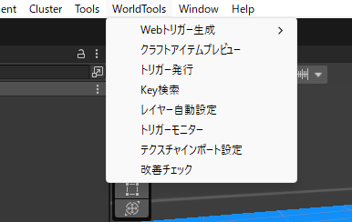
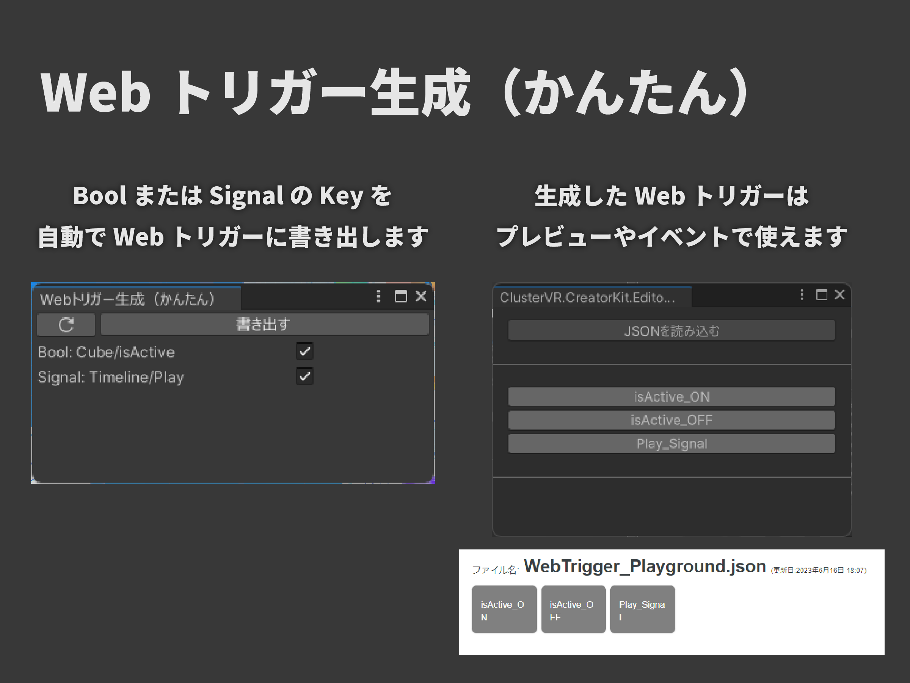
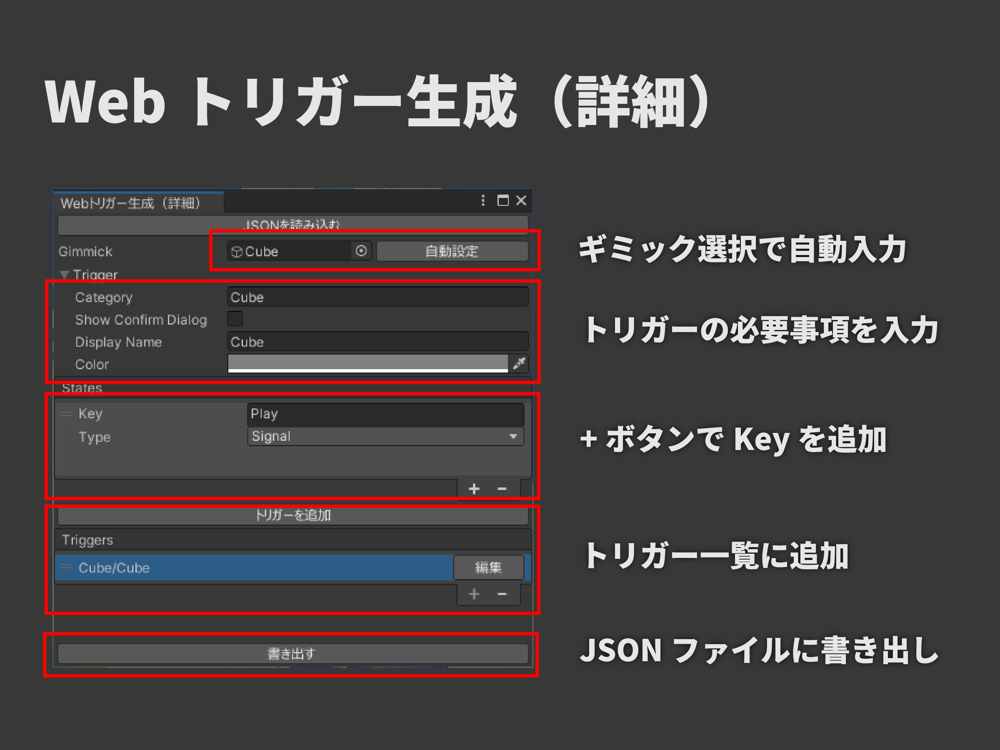
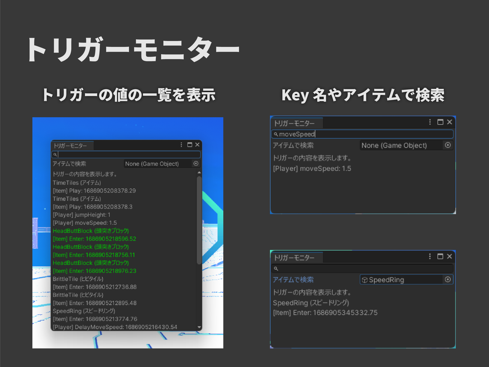
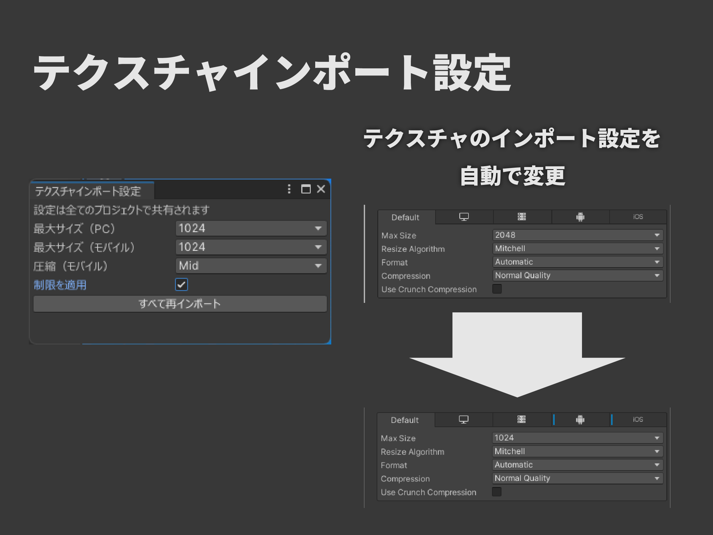
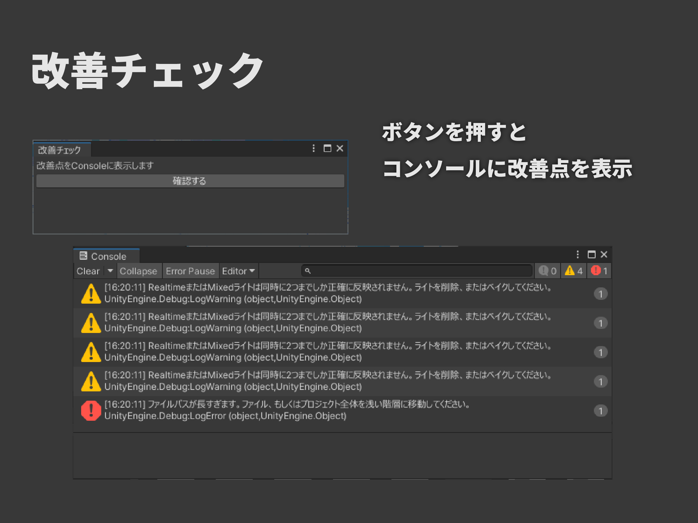
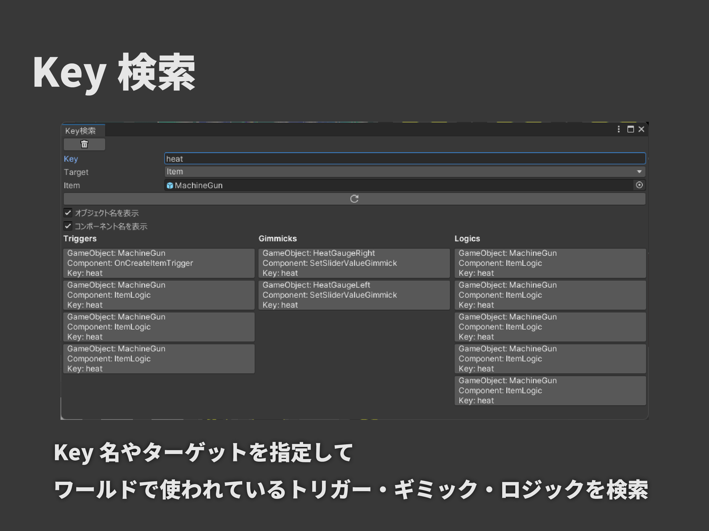

# Cluster World Tools
## 概要
Cluster Creator Kitでのワールド制作を便利にするエディタ拡張です。

## 導入方法
### Package Managerを使った導入
Unityエディター上部メニューのWindow>Package Managerを開きます。

左上の+ボタンから「Add package from git URL」を選択し、以下のURLを入力します。
```
https://github.com/ClusterVR/ClusterWorldTools.git
```

### UnityPackageでの導入
ReleasesからLatestを選択し、ClusterWorldTools.unitypackageをダウンロードしてください。

ダウンロードしたものをClusterワールドのUnityプロジェクトにインポートしてください。

## 使い方（メニュー機能）
上部メニュー「WorldTools」から利用できる機能です。



### Webトリガー生成（かんたん）
シーン内のギミックコンポーネントからbool型とsignal型のKeyの一覧を表示し、選択してWebトリガー用のJSONファイルを書き出すことができます。

書き出したJSONファイルはイベントページやエディタ上のWebトリガーウインドウから読み込んで使うことができます。

イベントでの利用のほか、デバッグ時に簡易的にギミックを動かす場合などにもオススメです。



### Webトリガー生成（詳細）
詳細な設定をしてWebトリガーを生成しJSONに書き出すことができます。

手入力のほか、ギミックコンポーネントのついたオブジェクトを読み込むことでいくつかの項目を自動入力できます。
また、既存のJSONを読み込むこともできます。

こちらは設定できる項目が多く、複雑なWebトリガーを作成できます。
Webトリガーの詳細は[Cluster Creator Kit公式ドキュメント](https://docs.cluster.mu/creatorkit/event/web-trigger/)を参照してください。



### レイヤー自動設定
clusterのワールドに利用できるレイヤーを自動で設定します。

### トリガーモニター
プレビュー実行中にトリガーの値を確認できます。Key検索やアイテム検索で抽出して表示することもできます。

Integer型やFloat型は値がそのまま、Bool型は0か1で表示されます。
Signal型は変更されたときに緑色に光ります。



### テクスチャインポート設定
テクスチャインポート時にサイズ上限とモバイルでの圧縮形式を自動で設定し、一括で軽量化することができます。
PC・モバイル別のサイズ上限と、モバイルでの圧縮品質を選択できます。

初期状態ではこの機能は無効です。設定ウインドウで「制限を適用」にチェックを入れると自動で適用されるようになります。

※設定は自動で適用されますが、設定変更時は再インポートをおこなう必要があります。

※この設定はプロジェクトごとに保存されます。



### 改善チェック
よくある不具合・エラーの原因をチェックしてConsoleに表示します。 一部は自動修正することができます。

Console上のエラーや警告をクリックすると、不備のあるオブジェクトを確認することができます。

それぞれのチェック項目は個別に有効・無効を選択することができます。



### Key検索
条件を指定して、シーン上で使われているKeyを検索します。

表示されたKeyをクリックするとそのオブジェクトが選択され、また同じ条件のKeyを再検索することができます。



### クラフトアイテムプレビュー
PrefabやGameObjectを指定して、ワールドクラフトに設置した際の見た目をシミュレーションすることができます。

ワールドクラフトの「ワールド環境>エフェクト」で設定できる「光の強さ」「カラーフィルタ」が適用された見た目を確認することができます。


### クイックアクセス
フォルダやアセットをお気に入り登録し、よく使うフォルダをすぐに表示できます。 選択履歴から開くこともできます。

## 使い方（その他の機能）

### 基本オブジェクト作成
GameObjectメニューから以下のオブジェクトを作成できます。
- Spawn Point
- Despawn Height
- Main Screen
- 移動速度・ジャンプ力変更ギミック

### Audio Listener自動削除
Camera設置時などに追加されるAudio Listenerコンポーネントを自動で削除します。

EditorOnlyタグの設定されたGameObjectに対しては自動削除しません。

### Post Process Volumeレイヤー自動変更
シーンにPost Process Volumeが設置されたときに、自動でレイヤーを「21: Post Processing」に変更します。

### 自動非アクティブ化タグ
GameObjectに「DeactivateOnUpload」タグを設定することで、アップロード時にそのGameObjectが自動で非アクティブ状態になります。

初期状態を非アクティブにしておきたいGameObjectに設定しておくことで、編集等のため一時的にアクティブ化したままにしてしまうことを防止できます。

### Hierarchy表示拡張
Hierarchy上で主要なコンポーネントのアイコンを表示したり、タグやレイヤによって色を付けて表示することができます。

子階層が折り畳まれているときは、子オブジェクトのコンポーネントやタグ・レイヤも表示されます。
